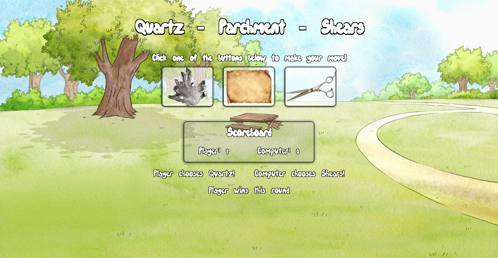

# rock-paper-scissors
A web-based Rock Paper Scissors game made with HTML, CSS and vanilla JavaScript.

The game itself is a reference to the game [Quartz Parchment Shears](https://www.youtube.com/watch?v=Mu79PNuINs8) from [Regular Show](https://en.wikipedia.org/wiki/Regular_Show).

## How to play
Visit this [webpage](https://lbonino.github.io/rock-paper-scissors/src/templates/index.html) to play the game.

Quartz beats Shears, Shears beat Parchment and Parchment beats Quartz. 

The first to win 5 rounds wins the game. Refresh the page to play again.

## Preview

